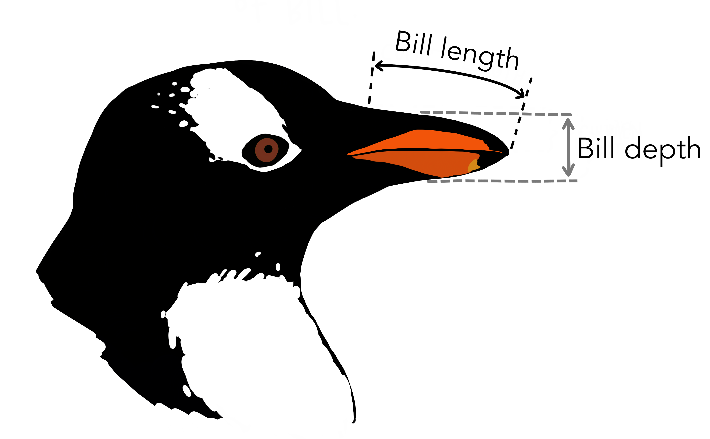
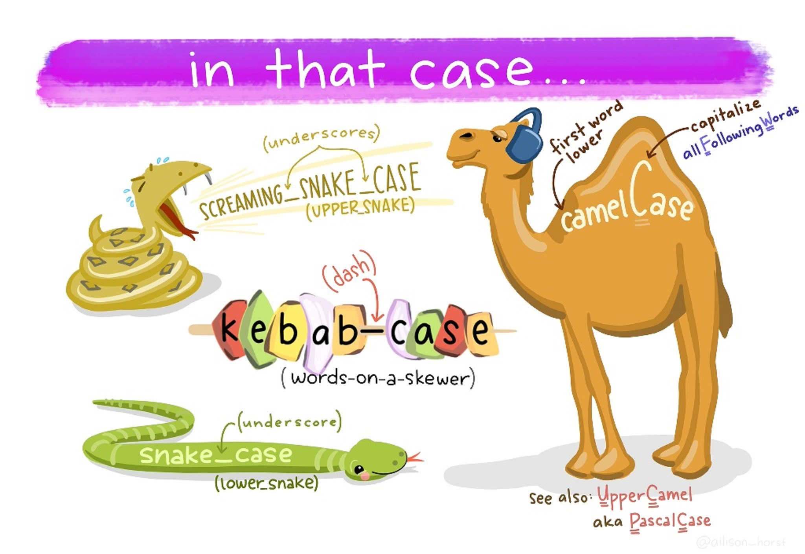

```{r setup, include=FALSE}
library(palmerpenguins)
library(tidyverse)
library(cowplot)
library(equatiomatic)

knitr::opts_chunk$set(echo = TRUE)
source("render_toc.R")
```


```{r welcome, fig.margin = TRUE, echo = FALSE, fig.width=12}
knitr::include_graphics("img/r_first_then.png")
```
`Make sure you read this whole document now, and complete all the instructions before the end of Friday - at the end of each week is a Blackboard quiz for you to complete.`
`I will send reminders, but you must complete these every week`

**Notes for Phil delete at end - embed videos, finish all exercises, proof!** At L402 so far. 

The main goal of this week is to introduce you to R and RStudio^[[R](https://www.r-project.org/) is the name of the programming language itself and [RStudio](img/rstudio-ide.pdf) is a convenient interface.], which we will be using throughout the course in order to learn statistical concepts, bioinformatics & data visualisation.^[**Pro-tip**: these side-bars are full of extra info & hyperlinks to extra information!]

An additional goal is to introduce you to git and GitHub^[[GitHub](https://www.youtube.com/watch?v=w3jLJU7DT5E) is a fantastic resource for data reproducibility and collaborative programming, check out this short (and very cheesy) intro video.], which is the collaboration and version control system that we will be using throughout the course. More on this later.

By the end of this course you will have the tools to analyze real data and come to informed conclusions. 

The taught content this autumn will be given to you in several **worksheets**, of which this is the first. Each worksheet covers one topic **module** and will be split into sections, and you should aim to complete one section per week. I will send you regular emails to remind you about this. Each section will comprise of a mini-lecture, some solo and group exercises and suggestions for further reading. 

Our first module "Hello R!" is only one week long, but our next module "Welcome to the Tidyverse" will run across weeks 2 & 3.

```{r toc, echo=FALSE}
render_toc("wkshp01.Rmd")
```


# Week One^[In follow on weeks, our Tuesday lecture time will be 'flipped' a place to ask questions and review the previous week. Each week there will be short assignments and projects, some will be designed to completed solo, while others are designed to be collaborative and we can run in our Friday session]

We have **two** live events in week 1: 

- Tuesdays 2PM (1 hour) - Introduction and questions about the course. I will give an overview of the course and introduce myself. Please fill out this survey form **before** the class.

- Fridays 2PM (2 hours) - Introducing yourself to R. Everything you need to complete this week's work is already in this worksheet, but on Friday we will host a live Blackboard Collaborate session to go through this together.    

As the labs progress, you are encouraged to explore beyond what the labs dictate; a willingness to experiment, make mistakes, and share with others will make you a much better programmer. Before we get to that stage, however, you need to build some basic fluency in R. 

## 1.1 Aspirations
We are going to start somewhere much more basic, but lets have a look at the sorts of visualisations you can create with R: 

```{r penguin image, fig.margin = TRUE, fig.width=3, echo=FALSE}

```

```{marginfigure}
This is from the **palmer penguins** dataset curated by Dr. Allison Horst. Data were originally collected and made available by Dr. Kristen Gorman and the Palmer Station, Antarctica LTER. 
We will use this dataset quite a bit as we get to grips with R, and soon you will be able to recreate figures like this from code. 
```

```{r penguin figure, echo = FALSE, warning=FALSE, message=FALSE}
bill_len_dep <- ggplot(data = penguins,
                         aes(x = bill_length_mm,
                             y = bill_depth_mm,
                             group = species)) +
  geom_point(aes(color = species,
                 shape = species),
             size = 3,
             alpha = 0.5) +
  geom_smooth(method = "lm", se = TRUE, aes(color = species, fill=species), show_guide=FALSE) +
  theme_cowplot() +
  scale_color_manual(values = c("darkorange","purple","cyan4")) +
  scale_fill_manual(values = c("darkorange","purple","cyan4"))+
  labs(title = "Penguin bill dimensions",
       subtitle = "Bill length and depth for Adelie, Chinstrap and Gentoo Penguins at Palmer Station LTER",
       x = "Bill length (mm)",
       y = "Bill depth (mm)",
       color = "Penguin species",
       shape = "Penguin species") +
  theme(legend.position = c(0.75, 0.15),
        legend.background = element_rect(fill = "white", color = NA),
        plot.title.position = "plot",
        plot.caption = element_text(hjust = 0, face= "italic"),
        plot.caption.position = "plot")

bill_len_dep
```

```{r, echo=FALSE, results='asis'}
m <- lm(bill_length_mm~bill_depth_mm*species, data=penguins)
extract_eq(m, wrap=TRUE)
```


The following screencast walks you through an explanation of how this was made - over the next few weeks you will learn how to generate visuals and models like those demonstrated here

<div style="position:relative;height:0;padding-bottom:40%"><iframe width="600" height="320" src="https://www.youtube.com/embed/8Ta_SJq3MrU" frameborder="0" allow="autoplay; encrypted-media" allowfullscreen></iframe></div>

## 1.2 Getting started
Today however, we begin with the fundamentals. The building blocks of R and RStudio: the interface, how R works, and basic commands.

- RStudio Cloud

- Navigating the interface


## 1.3 Individual Exercises - typing in commands in the R console
###https://github.com/djnavarro/rbook/blob/master/bookdown/02.03-introR.Rmd

**Try these exercises on your own, and work at your own pace - the only goal is to have tried these before we meet on Friday**

One of the easiest things you can do with R is use it as a simple calculator, so it's a good place to start. For instance, try typing `10 + 20`, and hitting enter.^[Seriously, open up RStudio Cloud and start typing. The simple act of typing it rather than "just reading" makes a big difference. It makes the concepts more concrete, and it ties the abstract ideas (programming and statistics) to the actual context in which you need to use them. Statistics is something you *do*, not just something you read about in a textbook.] When you do this, you've entered a ***command***, and R will "execute" that command. What you see on screen now will be this:

```{r eval=FALSE}
> 10 + 20
[1] 30
```

Not a lot of surprises in this extract. But there's a few things worth talking about, even with such a simple example. Firstly, it's important that you understand how to read the extract. In this example, what **you** typed was the `10 + 20` part. You didn't type the `>` symbol: that's just the R command prompt and isn't part of the actual command. And neither did you type the `[1] 30` part. That's what R printed out in response to the command. 

Secondly, it's important to understand how the output is formatted. Obviously, the correct answer to the sum `10 + 20` is `30`, and not surprisingly R has printed that out as part of its response. But it's also printed out this `[1]` part, which probably doesn't make a lot of sense to you right now. You're going to see that a lot. You can think of `[1] 30` as if R were saying "the answer to the 1st question you asked is 30".

### An important digression about formatting

Now that I've taught you these rules I'm going to change them pretty much immediately. That is because I want you to be able to copy code from the book directly into R if if you want to test things or conduct your own analyses. However, if you copy this kind of code (that shows the command prompt and the results) directly into R you will get an error - try it for yourself: `> 10 + 20`

```{r error=TRUE}
> 10 + 20
[1] 30
```

So instead, I'm going to provide code in a slightly different format so that it looks like this...

```{r}
10 + 20
```

There are two main differences. 

- In your console, you type after the >, but from now I won’t show the command prompt 

This means that if you’re working with this html, you can easily copy code out of the book and into the console.


### Be very careful to avoid typos

Before we go on to talk about other types of calculations that we can do with R, there's a few other things I want to point out. The first thing is that, while R is good software, it's still software. It's pretty stupid, and because it's stupid it can't handle typos. It takes it on faith that you meant to type *exactly* what you did type. For example, suppose that you forgot to hit the shift key when trying to type `+`, and as a result your command ended up being `10 = 20` rather than `10 + 20`. Try it for yourself and replicate this error message:

```{r error=TRUE}
10 = 20
```

What's happened here is that R has attempted to interpret `10 = 20` as a command, and spits out an error message because the command doesn't make any sense to it. When a *human* looks at this, and then looks down at his or her keyboard and sees that `+` and `=` are on the same key, it's pretty obvious that the command was a typo. But R doesn't know this, so it gets upset. And, if you look at it from its perspective, this makes sense. All that R "knows" is that `10` is a legitimate number, `20` is a legitimate number, and `=` is a legitimate part of the language too. In other words, from its perspective this really does look like the user meant to type `10 = 20`, since all the individual parts of that statement are legitimate and it's too stupid to realise that this is probably a typo. Therefore, R takes it on faith that this is exactly what you meant... it only "discovers" that the command is nonsense when it tries to follow your instructions, typo and all. And then it whinges, and spits out an error.

Even more subtle is the fact that some typos won't produce errors at all, because they happen to correspond to "well-formed" R commands. For instance, suppose that not only did I forget to hit the shift key when trying to type `10 + 20`, I also managed to press the key next to one I meant do. The resulting typo would produce the command `10 - 20`. Clearly, R has no way of knowing that you meant to *add* 20 to 10, not *subtract* 20 from 10, so what happens this time is this:

```{r}
10 - 20
```


In this case, R produces the right answer, but to the the wrong question. 

To some extent, I'm stating the obvious here, but it's important. The people who wrote R are smart. You, the user, are smart. But R itself is dumb. And because it's dumb, it has to be mindlessly obedient. It does *exactly* what you ask it to do. There is  no equivalent to "autocorrect" in R, and for good reason. When doing advanced stuff -- and even the simplest of statistics is pretty advanced in a lot of ways -- it's dangerous to let a mindless automaton like R try to overrule the human user. But because of this, it's **your** responsibility to be careful. Always make sure you type *exactly what you mean*. When dealing with computers, it's not enough to type "approximately" the right thing. In general, you absolutely *must* be precise in what you say to R ... like all machines it is too stupid to be anything other than absurdly literal in its interpretation.

### R is (a bit) flexible with spacing

There are some situations in which R does show a bit more flexibility than my previous description suggests. The first thing R is smart enough to do is ignore redundant spacing. What I mean by this is that, when I typed `10 + 20` before, I could equally have done this

```{r eval=FALSE}
10    + 20
```

or this
```{r eval=FALSE}
10+20
```

and I would get exactly the same answer **try it for yourself**. However, that doesn't mean that you can insert spaces in any old place. For example you can type `citation()` to get some information about how to cite R. **Try it**

```{r eval=FALSE}
citation()
```

... it tells you to cite R when you have used it for data analysis. What happens when the spacing is changed? If you insert spaces in between the word and the parentheses, or inside the parentheses themselves, then all is well. That is, either of these two commands

```{r eval=FALSE}
citation ()
```

```{r eval=FALSE}
citation(  )
```


will produce exactly the same response. However, what I can't do is insert spaces in the middle of the word. If I try to do this, R gets upset - try it:

```{r error=TRUE}
citat ion()
```

### R can sometimes tell that you're not finished yet (but not often)

One more thing I should point out. If you hit enter in a situation where it's "obvious" to R that you haven't actually finished typing the command, R is just smart enough to keep waiting. For example, if you type `10 + ` and then press enter, even R is smart enough to realise that you probably wanted to type in another number. So what happens? :

```
> 10+
+ 
```

and there's a blinking cursor next to the plus sign. What this means is that R is still waiting for you to finish. It "thinks" you're still typing your command, so it hasn't tried to execute it yet. In other words, this plus sign is actually another command prompt. It's different from the usual one (i.e., the `>` symbol) to remind you that R is going to "add" whatever you type now to what you typed last time. For example, type `3` and hit enter, then it finishes the command:

```
> 10 +
+ 20
[1] 30
```

And as far as R is concerned, this is *exactly* the same as if you had typed `10 + 20`. Using the `+` sign is a big part of stringing together commands when we start to build complex plots, so you are likely to stumble over using `+` quite a lot. Similarly, consider the `citation()` command that we talked about in the previous section. Suppose you hit enter after typing `citation(`. Once again, R is smart enough to realise that there must be more coming -- since you need to add the `)` character --  so it waits. I can even hit enter several times and it will keep waiting^[If you want to get out of this situation, just hit the ‘escape’ key]: 
```
> citation(
+ 
+ 
+ )
```

What about if I typed `citation` and hit enter? In this case we get something very odd, something that we definitely *don't* want, at least at this stage. Here's what happens:

```
citation
## function (package = "base", lib.loc = NULL, auto = NULL) 
## {
##     dir <- system.file(package = package, lib.loc = lib.loc)
##     if (dir == "") 
##         stop(gettextf("package '%s' not found", package), domain = NA)
BLAH BLAH BLAH
```
where the `BLAH BLAH BLAH` goes on for rather a long time, and you don't know enough R yet to understand what all this gibberish actually means (of course, it doesn't actually say BLAH BLAH BLAH - it says some other things we don't understand or need to know that I've edited for length) This incomprehensible output can be quite intimidating to novice users, and unfortunately it's very easy to forget to type the parentheses; so almost certainly you'll do this by accident. Do not panic when this happens. *Simply ignore the gibberish*.


### Doing simple calculations with R

Okay, now that we've discussed some of the tedious details associated with typing R commands, let's get back to learning how to use the most powerful piece of statistical software in the world as a \$2 calculator. So far, all we know how to do is addition. Clearly, a calculator that only did addition would be a bit stupid, so I should tell you about how to perform other simple calculations using R. But first, some more terminology. Addition is an example of an "operation" that you can perform (specifically, an arithmetic operation), and the ***operator*** that performs it is `+`. To people with a programming or mathematics background, this terminology probably feels pretty natural, but to other people it might feel like I'm trying to make something very simple (addition) sound more complicated than it is (by calling it an arithmetic operation). To some extent, that's true: if addition was the only operation that we were interested in, it'd be a bit silly to introduce all this extra terminology. However, as we go along, we'll start using more and more different kinds of operations, so it's probably a good idea to get the language straight now, while we're still talking about very familiar concepts like addition! 

### Adding, subtracting, multiplying and dividing

So, now that we have the terminology, let's learn how to perform some arithmetic operations in R.These `operators` correspond to the basic arithmetic we learned in primary school: addition, subtraction, multiplication and division. 

```{r arithmetic1, echo=FALSE}
knitr::kable(rbind(
              c("addition", "`+`", "10 + 2", 12),
              c("subtraction", "`-`", "9 - 3", 6),
              c("multiplication", "`*`", "5 * 5", 25),
              c("division", "`/`", "10 / 3", 3),
              c("power", "`^`", "5 ^ 2", 25)
),
caption = 'Basic arithmetic operations in R. These five operators are used very frequently throughout the text, so it\'s important to be familiar with them at the outset.',col.names = c("operation", "operator", "example input" , "example output"), align="lccc",
  booktabs = TRUE)
```

As you can see, R uses fairly standard symbols to denote each of the different operations you might want to perform: addition is done using the `+` operator, subtraction is performed by the `-` operator, and so on. So if you wanted to find out what 57 times 61 is (and who wouldn't?), you can use R instead of a calculator, like so:
```{r eval=FALSE}
57 * 61
```

So that's handy. *By the way what was the answer?* 

### Taking powers


The first four operations listed in the Table above are things we all learned in primary school, but they aren't the only arithmetic operations built into R. 

As I'm sure everyone will probably remember the moment they read this, the act of multiplying a number $x$ by itself $n$ times is called "raising $x$ to the $n$-th power". Mathematically, this is written as $x^n$. Some values of $n$ have special names: in particular $x^2$ is called $x$-squared, and $x^3$ is called $x$-cubed. So, the 4th power of 5 is calculated like this:
$$
5^4 = 5 \times 5 \times 5 \times 5 
$$

One way that we could calculate $5^4$ in R would be to type in the complete multiplication as it is shown in the equation above. That is, we could do this

```{r}
5 * 5 * 5 * 5
```

but it does seem a bit tedious. It would be very annoying indeed if you wanted to calculate $5^{15}$, since the command would end up being quite long. Therefore, to make our lives easier, we use the power operator instead. When we do that, our command to calculate $5^4$ goes like this:
```{r}
5 ^ 4
```
Much easier.


### Doing calculations in the right order{#bodmas}

Okay. At this point, you know how to take one of the most powerful pieces of statistical software in the world, and use it as a Casio calculator. And as a bonus, you've learned a few very basic programming concepts. In order to use R more effectively, we need to introduce more programming concepts.

In most situations where you would want to use a calculator, you might want to do multiple calculations. R lets you do this, just by typing in longer commands. 

```{r}
1 + 2 * 4
```

Clearly, this isn't a problem for R either. However, it's worth stopping for a second, and thinking about what R just did. Clearly, since it gave us an answer of `9` it must have multiplied `2 * 4` (to get an interim answer of 8) and then added 1 to that. But, suppose it had decided to just go from left to right: if R had decided instead to add `1+2` (to get an interim answer of 3) and then multiplied by 4, it would have come up with an answer of `12`. 

To answer this, you need to know the **_order of operations_** that R uses. It's actually the same order that you got taught when you were at school: the "**_BODMAS_**" order. 
That is, first calculate things inside **B**rackets `()`, then calculate **O**rders of (exponents) `^`, then **D**ivision `/` and **M**ultiplication `*`, then **A**ddition `+` and **S**ubtraction `-`. So, to continue the example above, if we want to force R to calculate the `1+2` part before the multiplication, all we would have to do is enclose it in brackets:

```{r}
(1 + 2) * 4 
```

This is a fairly useful thing to be able to do. The only other thing I should point out about order of operations is what to expect when you have two operations that have the same priority: that is, how does R resolve ties? For instance, multiplication and division are actually the same priority, but what should we expect when we give R a problem like `4 / 2 * 3` to solve? If it evaluates the multiplication first and then the division, it would calculate a value of two-thirds. But if it evaluates the division first it calculates a value of 6. The answer, in this case, is that R goes from *left to right*, so in this case the division step would come first:

```{r}
4 / 2 * 3
```

All of the above being said, it's helpful to remember that *brackets always come first*. So, if you're ever unsure about what order R will do things in, an easy solution is to enclose the thing *you* want it to do first in brackets.  There's nothing stopping you from typing `(4 / 2) * 3`. By enclosing the division in brackets we make it clear which thing is supposed to happen first. 


### Storing a number as a variable{#assign}

One of the most important things to be able to do in R (or any programming language, for that matter) is to store information in **_variables_**. At a conceptual level you can think of a variable as *label* for a certain piece of information, or even several different pieces of information. When doing statistical analysis in R all of your data (the variables you measured in your study) will be stored as variables in R, let's look at the very basics for how we create variables and work with them. 

### Variable assignment using `<-`

Since we've been working with numbers so far, let's start by creating variables to store our numbers. And since most people like concrete examples, let's invent one. Suppose I'm trying to calculate how many apples I have (hard hitting issues only here).
What I want to do is assign a **_value_** to my variable `apples`, and that value should be `5`. We do this by using the **_assignment operator_**, which is `<-`. Here's how we do it copy this code:

```{r}
apples <- 5
```

then try this
```{r eval=FALSE}
apples
```

So I have 5 apples, that's nice to know. Anytime you can't remember what R has got stored in a particular variable, you can just type the name of the variable and hit enter. 


### Doing calculations using variables

Okay, let's get back to my original story. In my quest to up my Vitamin C intake, I also want to know how many oranges I have

```{r}
apples <- 5
oranges <- 7
```

The nice thing about variables (in fact, the whole point of having variables) is that we can do anything with a variable that we ought to be able to do with the information that it stores. That is, since R allows me to add `5` and `7`

```{r eval=FALSE}
5 + 7
```

it also allows me to add apples and oranges

```{r}
apples + oranges
```

As far as R is concerned, the command is the same. Not surprisingly, I can assign the output of this calculation to a new variable, which I'll call `fruit`. And when we do this, the new variable gets the value `12`, try running this command and then typing `fruit`

```{r}
fruit <- apples+oranges
```

That's fairly straightforward. A slightly more subtle thing we can do is reassign the value of my variable, based on its current value. For instance, suppose that each one of my students decides to bribe me by giving me more fruit!

```{r}
fruit <- fruit + 41
fruit
```

In this calculation, R has taken the old value of `fruit` and added 41 to that value, producing a value of 53. This new value is assigned to the `fruit` variable, **overwriting its previous value**. 

### Rules and conventions for naming variables

- Variable names cannot include spaces: therefore `my fruit` is not a valid name, but `my_fruit` is.
- Variable names are case sensitive: that is, `Fruit` and `fruit` are *different* variable names.
- Variable names cannot be one of the reserved keywords. These are special names that R needs to keep "safe" from us mere users, so you can't use them as the names of variables. The keywords are: `if`, `else`, `repeat`, `while`, `function`, `for`, `in`, `next`, `break`, `TRUE`, `FALSE`, `NULL`, `Inf`, `NaN`, `NA`, `NA_integer_`, `NA_real_`, `NA_complex_`, and finally,  `NA_character_`. Don't feel like you have to remember these: if you make a mistake and try to use one of the keywords as a variable name, R will complain about it like the whiny little automaton it is.

```{r snake_case, fig.margin = TRUE, echo = FALSE}

```

In addition to those rules that R enforces, there are some informal conventions that people tend to follow when naming variables. One of them you've already seen: i.e., don't use variables that start with a period. But there are several others. You aren't obliged to follow these conventions, and there are many situations in which it's advisable to ignore them, but it's generally a good idea to follow them when you can:


- Use informative variable names. As a general rule, using meaningful names like `orange` and `apple` is preferred over arbitrary ones like `variable1` and `variable2`. Otherwise it's very hard to remember what the contents of different variables actually are.

- Use short variable names. Typing is a pain and no-one likes doing it. So we much prefer to use a name like `apple` over a name like `pink_lady_apple`.

- Use one of the conventional naming styles for multi-word variable names. Suppose I want to name a variable that stores "my new salary". Obviously I can't include spaces in the variable name, so how should I do this? There are three different conventions that you sometimes see R users employing. Firstly, you can separate the words using periods or dashes, which would give you `my-new-salary` as the variable name. Alternatively, you could separate words using underscores, as in `my_new_salary` or if you are feeling shouty `MY_NEW_SALARY`. Finally, you could use capital letters at the beginning of each word (except the first one), which gives you `myNewSalary` as the variable name. There's no very strong reason to prefer one over the other, but we are going to being learning tidyverse style R, which for consistency uses **'snake_case'**


### Using functions to do calculations{#usingfunctions}

The symbols `+`, `-`, `*` and so on are examples of `operators`. As we've seen, you can do quite a lot of calculations just by using these operators. However, in order to do more advanced calculations (and later on, to do actual statistics), you're going to need to start using `functions`.
To get started, suppose I wanted to take the square root of 225. The  square root, in case your high school maths is a bit rusty, is just the opposite of squaring a number. So, for instance, since "5 squared is 25" I can say that "5 is the square root of 25". The usual notation for this is 

$$
\sqrt{25} = 5
$$
To calculate the square root of 25, I can do it in my head pretty easily, since I memorised my multiplication tables when I was a kid. It gets harder when the numbers get bigger, and pretty much impossible if they're not whole numbers. This is where something like R comes in very handy. 

Let's say I wanted to calculate $\sqrt{225}$, the square root of 225. There's two ways I could do this using R. 

Firstly, $\sqrt{x}$ is always the same as ${x}^{0.5}$ so I could use the power operator `^`, just like we did earlier:

```{r}
225 ^ 0.5
```

However, there's a second way that we can do this, since R also provides a ***square root function***, `sqrt()`. To calculate the square root of 255 using this function, what I do is insert the number `225` in the parentheses. That is, the command I type is this:

```{r}
sqrt(225)
```

and as you might expect from our previous discussion, the spaces in between the parentheses are purely cosmetic. I could have typed `sqrt(225)` or `sqrt( 225   )` and gotten the same result. When we use a function to do something, we generally refer to this as **_calling_** the function, and the values that we type into the function (there can be more than one) are referred to as the **_arguments_** of that function. 

Obviously, the `sqrt()` function doesn't really give us any new functionality, since we could have performed the square root calculations by using the power operator `^`. However, there are lots of other functions in R: in fact, almost everything of interest is an R function of some kind. 

### Function arguments, their names and their defaults{#functionarguments}

There's two more fairly important things that you need to understand about how functions work in R, and that's the use of "named" arguments, and default values" for arguments.
To understand what these two concepts are all about, I'll introduce another function. The `round()` function can be used to round some value to the nearest whole number. For example, I could type this:

```{r}
round(3.1415)
```
Pretty straightforward, really. What's happening is that this function contains an `argument` that the number needs to be rounded (i.e., `3.1415`)

However, suppose I only wanted to round it to two decimal places: that is, I want to get `3.14` as the output. The `round()` function supports this, by allowing you to input a *second* argument to the function that specifies the number of decimal places that you want to round the number to. In other words, I could do this: 

```{r}
round(3.14165, 2)
```

What's happening here is that I've specified *two* arguments: the first argument is the number that needs to be rounded (i.e., `3.1415`), the second argument is the number of decimal places that it should be rounded to (i.e., `2`), and the two arguments are separated by a comma. 
Functions often contain multiple arguments, allowing you to carry out complex tasks.


In this simple example, it's quite easy to remember which argument comes first and which one comes second, but for more complicated functions this is not easy. Fortunately, most R functions make use of ***argument names***. For the `round()` function, for example the number that needs to be rounded is specified using the `x` argument, and the number of decimal points that you want it rounded to is specified using the `digits` argument. Because we have these names available to us, we can specify the arguments to the function by name. We do so like this:
```{r}
round(x = 3.1415, digits = 2)
```

Notice that this is kind of similar in spirit to variable assignment, except that I used `=` here, rather than `<-`. In both cases we're specifying specific values to be associated with a label. However, there are some differences between what I was doing earlier on when creating variables, and what I'm doing here when specifying arguments, and so as a consequence it's important that you use `=` in this context.


As you can see, specifying the arguments by name involves a lot more typing, but it's also a lot easier to read, and it will be a lot easier for *you* or anyone reading your code to know what a particular function might be doing. This is much better for data reproducibility 
The writers of R functions will try to use conventional names for this reason making everyone's life easier. Or at least that's the theory...

One important thing to note is that when specifying the arguments using their names, it doesn't matter what order you type them in. But if you don't use the argument names, then you have to input the arguments in the correct order. In other words, these three commands all produce the same output... 

```{r}
round(3.14165, 2)
round(x = 3.1415, digits = 2)
round(digits = 2, x = 3.1415)
```

but this one does not...

```{r}
round(2, 3.14165)
```

How do you find out what the correct order is? There's a few different ways, but the easiest one is to look at the help documentation for the function^[ simply type `help(round)` or `help("round)`and read more (here)[https://www.r-project.org/help.html]]. 

Okay, so that's the first thing I said you'd need to know: argument names. The second thing you need to know about is default values. Notice that the first time I called the `round()` function I didn't actually specify the `digits` argument at all, and yet R somehow knew that this meant it should round to the nearest whole number. How did that happen? The answer is that the `digits` argument has a ***default value*** of `0`, meaning that if you decide not to specify a value for `digits` then R will act as if you had typed `digits = 0`. This is quite handy: the vast majority of the time when you want to round a number you want to round it to the nearest whole number, and it would be pretty annoying to have to specify the `digits` argument every single time. On the other hand, sometimes you actually do want to round to something other than the nearest whole number, and it would be even more annoying if R didn't allow this! Thus, by having `digits = 0` as the default value, we get the best of both worlds.

### Storing many numbers as a vector{#vectors}

At this point we've covered functions in enough detail, so let's return to our discussion of variables. When I introduced variables I showed you how we can use variables to store a single number. In this section, we'll extend this idea and look at how to store multiple numbers within the one variable. In R, the name for a variable that can store multiple values is a **_vector_**. So let's create one. 

### Creating a vector
Let's look at student numbers by module for 2020/21. Suppose I have three modules that I teach on `Data Science`, `Genetics` & `Field Ecology` and I have module enrolment numbers: `41`, `124` & `0`(not running this year - Coronavirus...) respectively.

What I would like to do is have a variable -- let's call it `students_by_module` -- that stores all this data. The first number stored should be. The simplest way to do this in R is to use the **_combine_** function, `c()`. To do so, all we have to do is type all the numbers you want to store in a comma separated list, like this:^[Notice that I didn't specify any argument names here. The `c()` function is one of those cases where we don't use names. We just type all the numbers, and R just dumps them all in a single variable.]

```{r}
students_by_module <- c(41,124,0)
students_by_module
```
To use the correct terminology here, we have a single variable here called `students_by_module`: this variable is a vector that consists of 3 **_elements_**. 

### Getting information out of vectors{#vectorsubset}

Let's consider the problem of how to get information out of a vector. At this point, you might have a sneaking suspicion that the answer has something to do with the `[1]` that R has been printing out. And of course you are correct. Suppose I want to pull out the numbers for the second module in the list.

```{r}
students_by_module[2]
```

Yep, that's the enrolment numbers for Genetics. 
This behaviour makes more sense when you realise that we can use this trick to create new variables. For example, I could create a `february.sales` variable like this:

```{r eval=FALSE}
genetics_student_numbers <- students_by_module[2]
genetics_student_numbers
```
Obviously, the new variable `genetics_student_numbers` should only have one element and so when I print it out this new variable, the R output begins with a `[1]` because `124` is the value of the first (and only) element. The fact that this also happens to be the value of the second element of `students_by_module` is irrelevant.


### Storing text data{#text}

A lot of the time your data will be numeric in nature, but not always. Sometimes your data really needs to be described using text, not using numbers. To address this, we need to consider the situation where our variables store text. To create a variable that stores the word "hello", we can type this:
```{r}
greeting <- "hello"
greeting
```

When interpreting this, it's important to recognise that the quote marks here *aren't* part of the string itself. They're just something that we use to make sure that R *knows* to treat the characters that they enclose as a piece of text data, known as a **_character string_**. In other words, R treats `"hello"` as a string containing the word "hello"; but if I had typed `hello` instead, R would go looking for a variable by that name! You can also use `'hello'` to specify a character string.

Okay, so that's how we store the text. Next, it's important to recognise that when we do this, R stores the entire word `"hello"` as a *single* element: our `greeting` variable is *not* a vector of five different letters. Rather, it has only the one element, and that element corresponds to the entire character string `"hello"`. To illustrate this, if I actually ask R to find the first element of `greeting`, it prints the whole string:
```{r eval=FALSE}
greeting[1]
```
Of course, there's no reason why I can't create a vector of character strings. For instance, if we were to continue with the example of my attempts to look at the student numbers by module, one variable I might want would include the names of all the `modules`.

```{r}
module_names <- c("Data Science", "Genetics", "Field Ecology")
```
This is a **_character vector_** containing 3 elements, each of which is the name of a month. So if I wanted R to tell me the name of the third module, all I would do is this:
```{r eval=FALSE}
modules_names[3]
```

### Looking at the type of data in a vector

So now we have looked at vectors that contain two different types of data `numeric` and `character`. There are more types, but for now let's look at how you check the data class of your vector

```{r}
class(module_names)
class(students_by_module)
```
You can see that R will tell you what type of data each vector contains. This is really useful, and something we will come back to in the future, because R is stupid and while it tells you what class your data `is` it doesn't always know what class your data `needs` to be, so you have to check and correct it. For now these are both fine, so let's continue: 

### Naming the elements of a vector

You have seen how the elements of a vector are referred to by their position, and that if you take an element and assign it to a new vector its position will change. One very powerful feature of R is the ability to give names to the elements of a vector

```{r}
names(students_by_module) <- module_names
students_by_module
```

Now when you call the vector students_by_module you can see that each element has been given the corresponding module name. Using the names function we set an argument that the vector students_by_module requires names for each element. We then used <- to set provide a character vector of the same length <- module_names. Now you can call elements of the vector by position *or* name. 

### Altering the elements of a vector

Sometimes you'll want to change the values stored in a vector. This could be done per element. So I just found out 30 extra students want to join this module because it's so amazing! 

```{r}
students_by_module["Data Science"] <- 71
students_by_module
```


Secondly, you often want to alter all of the elements of a vector at once. For instance, suppose I found out that student intake has doubled for next year and we expect each module to go up proportionately 

```{r}
students_by_module * 2
```

Of course maybe I want to keep a separate vector for next year's estimated numbers 

```{r}
students_by_module <- c(41,124,0)
names(students_by_module) <- module_names
next_year <- students_by_module * 2
```


### Storing "true or false" data{#logicals}

Time to move onto a third kind of data. A key concept in that a lot of R relies on is the idea of a **_logical value_**. A logical value is an assertion about whether something is true or false. This is implemented in R in a pretty straightforward way. There are two logical values, namely `TRUE` and `FALSE`. Despite the simplicity, a logical values are very useful things. Let's see how they work.

### Assessing mathematical truths

In George Orwell's classic book *1984*, one of the slogans used by the totalitarian Party was "two plus two equals five", the idea being that the political domination of human freedom becomes complete when it is possible to subvert even the most basic of truths. 

But they didn't have R. R will not be subverted. It has rather firm opinions on the topic of what is and isn't true, at least as regards basic mathematics. If I ask it to calculate `2 + 2`, it always gives the same answer, and it's not bloody 5:
```{r}
2 + 2
```
Of course, so far R is just doing the calculations. I haven't asked it to explicitly assert that $2+2 = 4$ is a true statement. If I want R to make an explicit judgement, I can use a command like this: 
```{r}
2 + 2 == 4
```
What I've done here is use the **_equality operator_**, `==`, to force R to make a "true or false" judgement.^[Note that this is a very different operator to the assignment operator `=` you saw previously. A common typo that people make when trying to write logical commands in R (or other languages, since the "`=` versus `==`" distinction is important in most programming languages) is to accidentally type `=` when you really mean `==`.] Okay, let's see what R thinks of the Party slogan:
```{r}
2+2 == 5
```
Take that Big Brother! Anyway, it's worth having a look at what happens if I try to *force* R to believe that two plus two is five by making an assignment statement like  `2 + 2 = 5` or `2 + 2 <- 5`. When I do this, here's what happens:
```{r error=TRUE}
2 + 2 = 5
```
R doesn't like this very much. It recognises that `2 + 2` is *not* a variable (that's what the "non-language object" part is saying), and it won't let you try to "reassign" it. While R is pretty flexible, and actually does let you do some quite remarkable things to redefine parts of R itself, there are just some basic, primitive truths that it refuses to give up. It won't change the laws of addition, and it won't change the definition of the number `2`. 

That's probably for the best.

### Logical operations
So now we've seen logical operations at work, but so far we've only seen the simplest possible example. You probably won't be surprised to discover that we can combine logical operations with other operations and functions in a more complicated way, like this:
```{r}
3*3 + 4*4 == 5*5
``` 
or this
```{r}
sqrt(25) == 5
```
Not only that, but as Table \@ref(tab:logicals) illustrates, there are several other logical operators that you can use, corresponding to some basic mathematical concepts. 

```{r logicals, echo=FALSE}
knitr::kable(rbind(
                    c("less than ", "<", "2 < 3", "`TRUE`"),
                    c("less than or equal to", "<=", "2 <= 2", "`TRUE`"),
                    c("greater than", ">", "2 > 3", "`FALSE`"),
                    c("greater than or equal to", ">=", "2 >= 2" , "`TRUE`"), 
                    c("equal to", "==", "2 == 3" , "`FALSE`"),
                    c("not equal to", "!=", "2 != 3" , "`TRUE`")),
              caption = 'Some logical operators. Technically I should be calling these "binary relational operators", but quite frankly I don\'t want to. It\'s my book so no-one can make me.',
              col.names = c("operation", "operator", "example input", "answer"),
  booktabs = TRUE
)
```

Hopefully these are all pretty self-explanatory: for example, the **_less than_** operator `<` checks to see if the number on the left is less than the number on the right. If it's less, then R returns an answer of `TRUE`:
```{r}
99 < 100
```
but if the two numbers are equal, or if the one on the right is larger, then R returns an answer of `FALSE`, as the following two examples illustrate:
```{r}
100 < 100
100 < 99
```
In contrast, the **_less than or equal to_** operator `<=` will do exactly what it says. It returns a value of `TRUE` if the number of the left hand side is less than or equal to the number on the right hand side. So if we repeat the previous two examples using `<=`, here's what we get: 
```{r}
100 <= 100
100 <= 99
```
And at this point I hope it's pretty obvious what the **_greater than_** operator `>` and the **_greater than or equal to_** operator `>=` do! Next on the list of logical operators is the **_not equal to_** operator `!=` which -- as with all the others -- does what it says it does. It returns a value of `TRUE` when things on either side are **NOT** identical to each other. Therefore, since $2+2$ isn't equal to $5$, we get:
```{r}
2 + 2 != 5
```


We're not quite done yet. There are three more logical operations that are worth knowing about. 

```{r logicals2, echo=FALSE}
knitr::kable(rbind(
                    c("not", "!", "!(1==1)", "`FALSE`"),
                    c("or", "|", "(1==1) | (2==3)", "`TRUE`"),
                    c("and", "&", "(1==1) & (2==3)", "`FALSE`")),
              caption = 'Some more logical operators.',
              col.names = c("operation", "operator", "example input", "answer"),
  booktabs = TRUE
)
```


These are the **_not_** operator `!`, the **_and_** operator `&`, and the **_or_** operator `|`. Like the other logical operators, their behaviour is more or less exactly what you'd expect given their names. For instance, if I ask you to assess the claim that "either $2+2 = 4$ *or* $2+2 = 5$" you'd say that it's true. Since it's an "either-or" statement, all we need is for one of the two parts to be true. That's what the `|` operator does:
```{r}
(2+2 == 4) | (2+2 == 5)
```
On the other hand, if I ask you to assess the claim that "both $2+2 = 4$ *and* $2+2 = 5$" you'd say that it's false. Since this is an *and* statement we need both parts to be true. And that's what the `&` operator does:
```{r}
(2+2 == 4) & (2+2 == 5)
```
Finally, there's the *not* operator, which is simple but annoying to describe in English. If I ask you to assess my claim that "it is not true that $2+2 = 5$" then you would say that my claim is true; because my claim is that "$2+2 = 5$ is false". And I'm right. If we write this as an R command we get this:  
```{r}
! (2+2 == 5)
```
In other words, since `2+2 == 5` is a `FALSE` statement, it must be the case that `!(2+2 == 5)` is a `TRUE` one. Essentially, what we've really done is claim that "not false" is the same thing as "true". Obviously, this isn't really quite right in real life. But R lives in a much more black or white world: for R everything is either true or false. No shades of gray are allowed. We can actually see this much more explicitly, like this:
```{r}
! FALSE
```
Of course, in our $2+2 = 5$ example, we didn't really need to use "not" `!` and "equals to" `==` as two separate operators. We could have just used the "not equals to" operator `!=` like this:
```{r}
2+2 != 5
```
But there are many situations where you really do need to use the `!` operator. We'll being using this a lot later on
 
### Storing and using logical data

Up to this point, I've introduced *numeric data* (in Sections \@ref(assign) and \@ref(vectors)) and *character data* (in Section \@ref(text)). So you might not be surprised to discover that these `TRUE` and `FALSE` values that R has been producing are actually a third kind of data, called *logical data*. That is, when I asked R if `2 + 2 == 5` and it said `[1] FALSE` in reply, it was actually producing information that we can store in variables. For instance, I could create a variable called `is.the.Party.correct`, which would store R's opinion:
```{r}
is.the.Party.correct <- 2 + 2 == 5
is.the.Party.correct
```
Alternatively, you can assign the value directly, by typing `TRUE` or `FALSE` in your command. Like this:
```{r}
is.the.Party.correct <- FALSE
is.the.Party.correct
```
Better yet, because it's kind of tedious to type `TRUE` or `FALSE` over and over again, R provides you with a shortcut: you can use `T` and `F` instead (but it's case sensitive: `t` and `f` won't work).^[Warning! `TRUE` and `FALSE` are reserved keywords in R, so you can trust that they always mean what they say they do. Unfortunately, the shortcut versions `T` and `F` do not have this property. It's even possible to create variables that set up the reverse meanings, by typing commands like `T <- FALSE` and `F <- TRUE`. This is kind of insane, and something that is generally thought to be a design flaw in R. Anyway, the long and short of it is that it's safer to use `TRUE` and `FALSE`.] So this works:
```{r}
is.the.Party.correct <- F
is.the.Party.correct
```
but this doesn't:
```{r error=TRUE}
is.the.Party.correct <- f
```

### Vectors of logicals

The next thing to mention is that you can store vectors of logical values in exactly the same way that you can store vectors of numbers (Section \@ref(vectors)) and vectors of text data (Section \@ref(text)). Again, we can define them directly via the `c()` function, like this:
```{r}
x <- c(TRUE, TRUE, FALSE)
x
```
or you can produce a vector of logicals by applying a logical operator to a vector. This might not make a lot of sense to you, so let's unpack it slowly. First, let's suppose we have a vector of numbers (i.e., a "non-logical vector"). For instance, we could use the `students_by_module` vector. Suppose I wanted R to tell me, for each module whether I actually have students to teach. I can do that by typing this: 
```{r}
students_by_module > 0
```
and again, I can store this in a vector if I want, as the example below illustrates:
```{r}
any_students <- students_by_module > 0
any_students
```


### Applying logical operation to text{#logictext}

You can also apply logical operations to text as well. It's just that we need to be a bit more careful in understanding how R interprets the different operations. In this section I'll talk about how the equal to operator `==` applies to text, since this is the most important one. Obviously, the not equal to operator `!=` gives the exact opposite answers to `==`

Okay, let's see how it works. In one sense, it's very simple. For instance, I can ask R if the word `"cat"` is the same as the word `"dog"`, like this:
```{r}
"cat" == "dog"
```
That's pretty obvious, and it's good to know that even R can figure that out. Similarly, R does recognise that a `"cat"` is a `"cat"`:
```{r}
"cat" == "cat"
```
Again, that's exactly what we'd expect. However, what you need to keep in mind is that R is not at all tolerant when it comes to grammar and spacing. If two strings differ in any way whatsoever, R will say that they're not equal to each other, as the following examples indicate:
```{r}
" cat" == "cat"
"cat" == "CAT"
"cat" == "c a t"
```

## Quitting R

There's one last thing I should cover in this chapter: how to quit R. When I say this, I'm not trying to imply that R is some kind of pathological addition and that you need to call the R QuitLine or wear patches to control the cravings (although you certainly might argue that there's something seriously pathological about being addicted to R). I just mean how to exit the program. Assuming you're running R in the usual way (i.e., through RStudio or the default GUI on a Windows or Mac computer), then you can just shut down the application in the normal way. However, R also has a function, called `q()` that you can use to quit, which is pretty handy if you're running R in a terminal window e.g. when using servers - we will cover some of this later in the course.

Regardless of what method you use to quit R, when you do so for the first time R will probably ask you if you want to save the "workspace image". We'll talk a lot more about loading and saving data in Section \@ref(load), but I figured we'd better quickly cover this now otherwise you're going to get annoyed when you close R at the end of the chapter. If you're using RStudio, you'll see a dialog box that looks like the one shown in Figure \@ref(fig:quitR). If you're using a text based interface you'll see this:
```{r eval=FALSE}
q()
## Save workspace image? [y/n/c]: 
```
The `y/n/c` part here is short for "yes / no / cancel". Type `y` if you want to save, `n` if you don't, and `c` if you've changed your mind and you don't want to quit after all. 

What does this actually *mean*? What's going on is that R wants to know if you want to save all those variables that you've been creating, so that you can use them later. This sounds like a great idea, so it's really tempting to type `y` or click the "Save" button. To be honest though, I very rarely do this, and it kind of annoys me a little bit... what R is *really* asking is if you want it to store these variables in a "default" data file, which it will automatically reload for you next time you open R. And quite frankly, if I'd wanted to save the variables, then I'd have already saved them before trying to quit. Not only that, I'd have saved them to a location of *my* choice, so that I can find it again later. So I personally never bother with this. 

In fact, every time I install R on a new machine one of the first things I do is change the settings so that it never asks me again. You can do this in RStudio really easily: use the menu system to find the RStudio option; the dialog box that comes up will give you an option to tell R never to whine about this again.

```{r no-one flies solo, fig.margin = TRUE, echo = FALSE, fig.width=12}
knitr::include_graphics("img/code_hero.jpg")
```

## Group Exercise One^[Working with others, sharing problems & solutions with talking and code sharing is the fastest way to get better we will have a space to post problems everyone should be participating as much as they can, not just in our 'live' sessions]

This workshop is designed to be run in small groups, where you are encouraged to talk with each other and discuss your observations. However, all of the materials you need to complete this are here, so don't worry if you can't make the live session (or simply want to go over it again in your own time). 

### Task one working with a matrix

R’s base data structures can be organised by their dimensionality (1d, 2d, or nd) and whether they’re homogeneous (all contents must be of the same type) or heterogeneous (the contents can be of different types). We have already been working with 1d structures `vectors`:

```{r logicals2, echo=FALSE}
knitr::kable(rbind(
                    c("1d","Vector", "List"),
                    c("2d", "Matrix", "Data Frame")),
              caption = 'Basic Data Structures',
              col.names = c("", "Homeogenous", "Heterogenous"),
  booktabs = TRUE
)
```

We are going to move into a new dimension (oooo!) as we consider data in a matrix. 

First copy this into your terminal and assign it as a vector we will call `x`

55.3846, 51.5385, 46.1538, 42.8205, 40.7692, 38.7179, 35.641, 33.0769, 28.9744, 26.1538, 23.0769, 22.3077, 22.3077, 23.3333, 25.8974, 29.4872, 32.8205, 35.3846, 40.2564, 44.1026, 46.6667, 50, 53.0769, 56.6667, 59.2308, 61.2821, 61.5385, 61.7949, 57.4359, 54.8718, 52.5641, 48.2051, 49.4872, 51.0256, 45.3846, 42.8205, 38.7179, 35.1282, 32.5641, 30, 33.5897, 36.6667, 38.2051, 29.7436, 29.7436, 30, 32.0513, 35.8974, 41.0256, 44.1026, 47.1795, 49.4872, 51.5385, 53.5897, 55.1282, 56.6667, 59.2308, 62.3077, 64.8718, 67.9487, 70.5128, 71.5385, 71.5385, 69.4872, 46.9231, 48.2051, 50, 53.0769, 55.3846, 56.6667, 56.1538, 53.8462, 51.2821, 50, 47.9487, 29.7436, 29.7436, 31.2821, 57.9487, 61.7949, 64.8718, 68.4615, 70.7692, 72.0513, 73.8462, 75.1282, 76.6667, 77.6923, 79.7436, 81.7949, 83.3333, 85.1282, 86.4103, 87.9487, 89.4872, 93.3333, 95.3846, 98.2051, 56.6667, 59.2308, 60.7692, 63.0769, 64.1026, 64.359, 74.359, 71.2821, 67.9487, 65.8974, 63.0769, 61.2821, 58.7179, 55.1282, 52.3077, 49.7436, 47.4359, 44.8718, 48.7179, 51.2821, 54.1026, 56.1538, 52.0513, 48.7179, 47.1795, 46.1538, 50.5128, 53.8462, 57.4359, 60, 64.1026, 66.9231, 71.2821, 74.359, 78.2051, 67.9487, 68.4615, 68.2051, 37.6923, 39.4872, 91.2821, 50, 47.9487, 44.1026


Then copy this into your terminal and assign it as vector `y`

97.1795, 96.0256, 94.4872, 91.4103, 88.3333, 84.8718, 79.8718, 77.5641, 74.4872, 71.4103, 66.4103, 61.7949, 57.1795, 52.9487, 51.0256, 51.0256, 51.0256, 51.4103, 51.4103, 52.9487, 54.1026, 55.2564, 55.641, 56.0256, 57.9487, 62.1795, 66.4103, 69.1026, 55.2564, 49.8718, 46.0256, 38.3333, 42.1795, 44.1026, 36.4103, 32.5641, 31.4103, 30.2564, 32.1795, 36.7949, 41.4103, 45.641, 49.1026, 36.0256, 32.1795, 29.1026, 26.7949, 25.2564, 25.2564, 25.641, 28.718, 31.4103, 34.8718, 37.5641, 40.641, 42.1795, 44.4872, 46.0256, 46.7949, 47.9487, 53.718, 60.641, 64.4872, 69.4872, 79.8718, 84.1026, 85.2564, 85.2564, 86.0256, 86.0256, 82.9487, 80.641, 78.718, 78.718, 77.5641, 59.8718, 62.1795, 62.5641, 99.4872, 99.1026, 97.5641, 94.1026, 91.0256, 86.4103, 83.3333, 79.1026, 75.2564, 71.4103, 66.7949, 60.2564, 55.2564, 51.4103, 47.5641, 46.0256, 42.5641, 39.8718, 36.7949, 33.718, 40.641, 38.3333, 33.718, 29.1026, 25.2564, 24.1026, 22.9487, 22.9487, 22.1795, 20.2564, 19.1026, 19.1026, 18.3333, 18.3333, 18.3333, 17.5641, 16.0256, 13.718, 14.8718, 14.8718, 14.8718, 14.1026, 12.5641, 11.0256, 9.8718, 6.0256, 9.4872, 10.2564, 10.2564, 10.641, 10.641, 10.641, 10.641, 10.641, 10.641, 8.718, 5.2564, 2.9487, 25.7692, 25.3846, 41.5385, 95.7692, 95, 92.6923


```{r}
workshop_dataset <- matrix(c(x,y),ncol=2)
```

Pull out a coordinate?

What is the correlation coefficient for x vs y - use help menu

Plot x & y- use base plots as gplot doesnt like matrix


